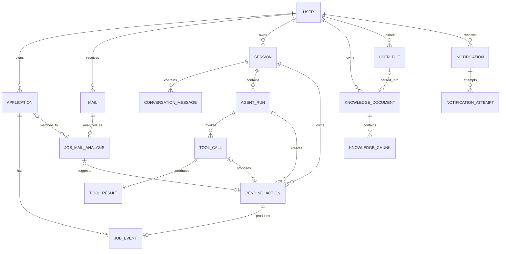

# 求职邮件与求职状态智能管理系统——最终总体设计

> 项目定位：校招项目 + 个人自用求职助手  
> 目标：以邮箱作为被动输入源，以 QQ Bot 作为主要交互入口，结合 LLM、Tool Calling、RAG、可靠通知和状态管理，实现求职邮件解析、求职状态维护、知识库管理和自然语言交互。
>
> 当前文档范围：总体架构、模块边界、领域模型、Agent Runtime、Tool Registry、PendingAction、Domain Event、Transactional Outbox、Notification、QQ Gateway、RAG/Chroma、核心时序和数据关系。

---

# 1. 总体目标

系统需要支持：

1. 通过 IMAP 持续接收邮箱新邮件。
2. 使用规则判断邮件是否为求职相关邮件。
3. 使用 LLM 将求职邮件解析为固定结构。
4. 自动将重要求职邮件通过 QQ Bot 通知用户。
5. 对可能引起求职状态变化的邮件生成状态更新建议。
6. 所有真实求职状态变化必须由用户确认。
7. 用户可以通过 QQ + LLM 主动维护没有邮件来源的求职状态。
8. 用户可以通过自然语言查询 Application、Mail、RAG。
9. 一轮对话允许连续调用多个 Tool。
10. Agent 以“完成用户当前任务”为终止条件。
11. 用户可通过 QQ 上传求职资料并写入 RAG 知识库。
12. RAG 使用独立 Embedding Model 与 Chroma 向量数据库。
13. 业务事件需要可靠传播，不能依赖纯内存 EventBus。
14. 主动 QQ 通知需要可恢复、可重试、尽量不丢。

---

# 2. 总体架构

```text
┌──────────────────────────────────────────────┐
│                    接入层                    │
│                                              │
│     IMAP Mail Gateway        QQ Gateway      │
│                              ├─ receive      │
│                              ├─ reply        │
│                              └─ push         │
└──────────────────────┬───────────────────────┘
                       ↓
┌──────────────────────────────────────────────┐
│                    业务层                    │
│                                              │
│ Mail Classification                          │
│ Job Mail Analysis                            │
│ Application Management                       │
│ Pending Action Management                    │
│ Notification                                 │
│ Conversation Agent                           │
│ Knowledge Management                         │
│ Knowledge Retrieval                          │
└──────────────────────┬───────────────────────┘
                       ↓
┌──────────────────────────────────────────────┐
│                    Tool 层                   │
│                                              │
│ Application Tools                            │
│ Mail Tools                                   │
│ RAG Tools                                    │
│ Utility Tools                                │
└──────────────────────┬───────────────────────┘
                       ↓
┌──────────────────────────────────────────────┐
│                  AI 能力层                   │
│                                              │
│ LLM Service                                  │
│ Embedding Service                            │
└──────────────────────┬───────────────────────┘
                       ↓
┌──────────────────────────────────────────────┐
│                   存储层                     │
│                                              │
│ Relational Database                          │
│ Chroma Vector Database                       │
│ Conversation Transcript                      │
└──────────────────────────────────────────────┘
```

系统由三条核心主线组成：

```text
1. 邮件 → 求职状态管理
2. QQ → Conversation Agent → Tool Calling
3. 文件 → Knowledge Management → RAG / Chroma
```

---

# 3. 核心设计原则

## 3.1 Application 是核心业务实体

Application 表示：

> 用户针对某一“公司 + 部门 + 岗位”的持续求职关系。

唯一业务键：

```text
company + department + position
```

相同三元组在系统生命周期内始终对应同一个 Application。

---

## 3.2 求职状态不是强制状态机

允许：

```text
APPLIED → INTERVIEW
REJECTED → INTERVIEW
ASSESSMENT → OFFER
```

系统记录用户认可的真实状态，不强制招聘流程按固定路线迁移。

---

## 3.3 LLM 没有真实业务状态修改权

LLM 可以：

- 解析邮件
- 理解自然语言
- 生成 Tool Call
- 生成写操作 Proposal
- 调用只读 Tool
- 生成最终回答

但不能未经用户确认：

- 更新 Application
- 创建真实 JobEvent
- 修改知识库
- 删除知识

统一写操作链路：

```text
LLM Proposal
 ↓
PendingAction
 ↓
用户确认
 ↓
Write Tool
```

---

## 3.4 核心业务同步，外围副作用事件化

```text
Query / Tool Call / 核心 Command
→ 同步 Service Call

核心业务修改
→ 同一数据库事务完成

业务完成后的可靠派生处理
→ Domain Event + Transactional Outbox
```

---

## 3.5 业务事实优先于生成式知识

```text
Application / JobEvent
        >
JobMailAnalysis
        >
RAG Retrieval
        >
LLM 自身生成
```

---

# 4. 求职状态体系

```text
APPLIED
SCREENING
ASSESSMENT
INTERVIEW
HR_INTERVIEW
OFFER
OFFER_ACCEPTED
REJECTED
TERMINATED
```

| 枚举 | 中文 |
|---|---|
| `APPLIED` | 投递中 |
| `SCREENING` | 筛选中 |
| `ASSESSMENT` | 笔试（含测评、笔试、在线编程、AI 面试） |
| `INTERVIEW` | 面试 |
| `HR_INTERVIEW` | HR 面 |
| `OFFER` | Offer |
| `OFFER_ACCEPTED` | Offer 确认 |
| `REJECTED` | 拒绝 |
| `TERMINATED` | 流程终止 |

面试轮次：

```text
status = INTERVIEW
round = N
```

---

# 5. 核心领域模型

```text
Mail
 ↓
JobMailAnalysis
 ↓
PendingAction
 ↓
用户确认
 ↓
JobEvent
 ↓
Application
```

| 对象 | 含义 |
|---|---|
| Mail | 原始邮箱事实 |
| JobMailAnalysis | LLM 对邮件的结构化理解 |
| PendingAction | 未确认的写操作 |
| JobEvent | 已确认的状态变化 |
| Application | 当前真实求职状态 |

---

# 6. Application

```text
Application
├── id
├── userId
├── company
├── department
├── position
├── currentStatus
├── currentInterviewRound?
├── latestJobEventId?
├── createdAt
└── updatedAt
```

唯一约束：

```text
UNIQUE(userId, company, department, position)
```

---

# 7. JobEvent

JobEvent 只记录用户确认后的求职状态变化：

```text
JobEvent
├── id
├── applicationId
├── pendingActionId
├── previousStatus
├── currentStatus
├── interviewRound?
├── confirmedAt
└── createdAt
```

不保存面试提醒、改期、会议链接、材料通知等非状态变化信息。

---

# 8. Mail 与 JobMailAnalysis

## 8.1 Mail

```text
Mail
├── id
├── userId
├── providerMessageId
├── subject
├── sender
├── recipients
├── receivedAt
├── content
├── createdAt
└── updatedAt
```

## 8.2 JobMailAnalysis

```text
JobMailAnalysis
├── application
├── mail
├── statusSuggestion
├── details
├── summary
└── confidence
```

其中：

```text
application
├── company
├── department
└── position
```

```text
mail
├── type
└── subject
```

邮件类型：

```text
APPLICATION
SCREENING
ASSESSMENT
INTERVIEW
HR
OFFER
REJECTION
TERMINATION
INFORMATION
OTHER
```

```text
statusSuggestion
├── shouldUpdate
├── status
├── interviewRound?
└── reason
```

```text
details
├── eventTime
├── deadline
├── location
├── importantInfo[]
└── actionItems[]
```

```text
confidence
├── applicationMatch
└── statusSuggestion
```

---

# 9. 邮件处理主流程

```text
IMAP
 ↓
Mail Gateway
 ↓
保存 Mail
 ↓
MAIL_RECEIVED
 ↓
Mail Classification
 ↓
是否求职邮件？
 ├─ No → 结束
 └─ Yes
      ↓
     LLM
      ↓
JobMailAnalysis
      ↓
JOB_MAIL_ANALYZED
```

分流：

```text
shouldUpdate = false
→ 普通求职通知

shouldUpdate = true
→ PendingAction
→ 用户确认
→ UpdateApplicationStatus
```

---

# 10. PendingAction

所有 Write Tool 统一使用：

```text
PendingAction
├── id
├── userId
├── sessionId?
├── agentRunId?
├── toolCallId?
├── mailAnalysisId?
├── actionType
├── resolvedArguments
├── displaySummary
├── state
├── createdAt
├── confirmedAt?
├── rejectedAt?
└── completedAt?
```

状态：

```text
PENDING
CONFIRMED
REJECTED
COMPLETED
```

规则：

1. 所有 Write Tool 必须先生成 PendingAction。
2. PendingAction 创建后参数不可修改。
3. 用户改变意图时，拒绝旧 Action，创建新 Action。
4. `确认 / 拒绝` 使用确定性 Command Router，不经过 LLM。
5. Session 可同时存在多个 PendingAction。
6. `activePendingActionId` 只表示默认确认目标。

确认协议：

```text
Write Tool Proposal
       ↓
PendingAction(PENDING)
       ↓
QQ 提示用户
       ↓
   ┌───┴────┐
   ↓        ↓
确认        拒绝
 ↓           ↓
CONFIRMED   REJECTED
 ↓
执行 Write Tool
 ↓
ToolResult
 ↓
COMPLETED
```

---

# 11. 状态更新的两个来源

## 11.1 邮件驱动

```text
Mail
 ↓
JobMailAnalysis
 ↓
PendingAction
 ↓
用户确认
 ↓
UpdateApplicationStatus
 ↓
Application Management
 ↓
JobEvent
 ↓
Application
```

## 11.2 用户主动驱动

```text
QQ Message
 ↓
Conversation Agent
 ↓
LLM
 ↓
Status Update Proposal
 ↓
PendingAction
 ↓
用户确认
 ↓
UpdateApplicationStatus
 ↓
Application Management
 ↓
JobEvent
 ↓
Application
```

---

# 12. Conversation Agent

职责：

1. 加载 Session Context。
2. 理解用户当前任务。
3. 调用一个或多个 Tool。
4. 消费 Tool Result。
5. 决定是否继续调用 Tool。
6. 直到任务完成。
7. 写操作进入 PendingAction。

核心循环：

```text
User Task
 ↓
LLM
 ↓
信息足够？
 ├─ Yes → Final Answer
 └─ No
     ↓
   Tool Call
     ↓
   Tool Result
     ↓
     LLM
```

不引入显式 SubTask / DAG / Workflow 编排系统。

---

# 13. Session 与 Context

一个 QQ 用户对应一个长期 Main Session。

```text
Session
├── id
├── userId
├── summary
├── activeApplicationId?
├── activeMailId?
├── activeKnowledgeDocumentId?
├── activePendingActionId?
├── createdAt
├── lastActiveAt
└── updatedAt
```

实际发送给 LLM 的上下文：

```text
System Prompt
+
Session Summary
+
Active Context
+
Recent Messages
+
Current User Message
+
Current Tool Results
```

```text
Transcript
= 完整历史

Session Summary
= 压缩历史

Recent Messages
= 当前局部上下文
```

Conversation Memory 与 RAG 分离。

---

# 14. Agent Runtime

```text
Session
  │
  ├── ConversationMessage[]
  │
  └── AgentRun[]
        │
        ├── ToolCall[]
        │     ↓
        │   ToolResult
        │
        └── PendingAction?
```

## AgentRun

```text
AgentRun
├── id
├── sessionId
├── userMessageId
├── finalMessageId?
├── state
├── createdAt
└── completedAt?
```

状态：

```text
RUNNING
WAITING_USER_CONFIRMATION
COMPLETED
```

## ToolCall

```text
ToolCall
├── id
├── agentRunId
├── toolName
├── arguments
├── sequence
└── createdAt
```

## ToolResult

```text
ToolResult
├── id
├── toolCallId
├── data
├── contextRefs
├── startedAt
├── completedAt
└── createdAt
```

持久化策略：

| 对象 | 是否持久化 |
|---|---|
| Session | 是 |
| ConversationMessage | 是 |
| AgentRun | 是 |
| ToolCall | 是 |
| ToolProposal | 否 |
| PendingAction | 是 |
| ToolExecution | 第一版否 |
| ToolResult | 是 |

---

# 15. Tool Registry

统一定义：

```text
ToolDefinition
├── name
├── description
├── category
├── permission
├── requiresConfirmation
├── inputSchema
└── outputSchema
```

分类：

```text
APPLICATION
MAIL
RAG
UTILITY
```

权限：

```text
READ
WRITE
```

---

# 16. Application Tools

```text
SearchApplications
GetApplication
GetApplicationStatus
GetStatusHistory
UpdateApplicationStatus
```

| Tool | 权限 | 用户确认 |
|---|---|---|
| SearchApplications | READ | 否 |
| GetApplication | READ | 否 |
| GetApplicationStatus | READ | 否 |
| GetStatusHistory | READ | 否 |
| UpdateApplicationStatus | WRITE | 是 |

统一引用：

```text
ApplicationRef
├── applicationId?
├── company?
├── department?
└── position?
```

---

# 17. Mail Tools

```text
SearchMails
GetRecentMails
GetMailAnalysis
GetMailContent
```

全部为 READ。

边界：

```text
Application = 当前求职事实
Mail        = 公司真实发送内容
RAG         = 可复用求职知识
```

---

# 18. RAG Tools

```text
SearchKnowledge
ParseDocument
AddKnowledge
RemoveKnowledge
```

| Tool | 权限 | 确认 |
|---|---|---|
| SearchKnowledge | READ | 否 |
| ParseDocument | TRANSFORM | 否 |
| AddKnowledge | WRITE | 是 |
| RemoveKnowledge | WRITE | 是 |

文件解析只用于 RAG 入库。

---

# 19. Tool 中间协议

```text
ToolCall
 ↓
ToolProposal
 ↓
是否需要确认？
 ├─ No → ToolExecution → ToolResult
 └─ Yes
      ↓
   PendingAction
      ↓
   用户确认
      ↓
   ToolExecution
      ↓
   ToolResult
```

ToolProposal 和 ToolExecution 第一版不单独持久化。

`ToolResult.contextRefs` 可包含：

```text
applicationId?
mailId?
knowledgeDocumentId?
pendingActionId?
fileId?
```

用于自动更新 Active Context。

---

# 20. Domain Event

统一事件 Envelope：

```text
DomainEvent
├── eventId
├── eventType
├── eventVersion
├── aggregateType
├── aggregateId
├── occurredAt
├── producer
├── correlationId?
├── causationId?
└── payload
```

事件表示“已经发生的事实”。

第一版事件：

```text
MAIL_RECEIVED
JOB_MAIL_ANALYZED
PENDING_ACTION_CREATED
PENDING_ACTION_RESOLVED
APPLICATION_STATUS_CHANGED
KNOWLEDGE_DOCUMENT_ADDED
KNOWLEDGE_DOCUMENT_REMOVED
```

---

# 21. Transactional Outbox

模块通信采用：

```text
同步 Service Call
+
Transactional Outbox
+
In-Process EventBus
```

核心状态更新：

```text
UpdateApplicationStatus
        ↓
┌──────── Database Transaction ────────┐
│ UPDATE Application                  │
│ INSERT JobEvent                     │
│ INSERT OutboxEvent                  │
└─────────────────────────────────────┘
        ↓
      COMMIT
```

Outbox：

```text
OutboxEvent
├── id
├── eventId
├── eventType
├── eventVersion
├── aggregateType
├── aggregateId
├── payload
├── correlationId?
├── causationId?
├── status
├── createdAt
└── publishedAt?
```

状态：

```text
PENDING
PUBLISHED
```

可靠性：

```text
At-least-once Delivery
+
Idempotent Consumer
```

消费者幂等：

```text
ProcessedEvent
├── consumerName
├── eventId
└── processedAt
```

---

# 22. Notification 模块

职责：

```text
Domain Event
 ↓
Notification Handler
 ↓
Notification Renderer
 ↓
Notification(PENDING)
 ↓
Notification Dispatcher
 ↓
QQ Gateway.push()
```

Notification：

```text
Notification
├── id
├── userId
├── type
├── channel
├── title
├── content
├── sourceEventId
├── relatedApplicationId?
├── relatedMailId?
├── relatedPendingActionId?
├── relatedKnowledgeDocumentId?
├── state
├── attemptCount
├── nextRetryAt?
├── lastAttemptAt?
├── sentAt?
├── createdAt
└── updatedAt
```

状态：

```text
PENDING
SENDING
RETRY_WAIT
SENT
FAILED
```

---

# 23. NotificationAttempt

```text
NotificationAttempt
├── id
├── notificationId
├── attemptNo
├── result
├── providerMessageId?
├── startedAt
├── completedAt
└── createdAt
```

发送模型：

```text
Notification(PENDING)
        ↓
Notification Dispatcher
        ↓
NotificationAttempt
        ↓
QQ Gateway.push()
        ↓
   ┌────┴─────┐
   ↓          ↓
  SENT    RETRY_WAIT
             ↓
          重试
             ↓
        SENT / FAILED
```

采用持久化重试，不依赖内存 Timer。

支持 stale `SENDING` 恢复。

语义：

> 尽量不丢，极端情况下允许重复。

---

# 24. Notification 与 Agent Reply 分离

```text
Agent Final Response
→ QQ Gateway.reply()

异步主动通知
→ Notification
→ Dispatcher
→ QQ Gateway.push()
```

---

# 25. QQ Gateway

```text
QQGateway
├── receive()
├── reply()
└── push()
```

- `receive()`：接收 QQ 用户消息、文件事件。
- `reply()`：回复当前用户消息。
- `push()`：主动发送邮件通知、PendingAction 确认等异步通知。

业务层只使用系统 `userId`，Gateway 负责映射 QQ `user_openid`。

---

## 25.1 botpy 2.0.4 具体适配器基线

v1 使用 `qq-botpy-sdk==2.0.4` 作为 QQ Gateway 的 SDK 实现，但 SDK
只属于基础设施适配层，不改变前文的 `QQGateway` 业务抽象。当前实现是
单用户、单邮箱账户、单 QQ 账号、单进程部署，不宣称多用户或多账号路由。

### 配置与构造门控

真实 botpy runtime 只有在以下条件同时满足时才构造：

```text
APP_QQ_ENABLED=true
APP_QQ_APP_ID 已设置
APP_QQ_APP_SECRET 已设置
APP_QQ_TOKEN_BASE_URL 已显式设置
APP_QQ_API_BASE_URL 使用 HTTPS
APP_QQ_TOKEN_BASE_URL 使用 HTTPS
```

`APP_QQ_APP_ID` 与 `APP_QQ_APP_SECRET` 必须成对出现。关闭门控或缺少完整
配置时，运行时保持 no-QQ / `FakeQQGateway` 路径；只提供部分凭据时，配置
加载安全失败且不得输出 Secret 值。

`APP_QQ_API_BASE_URL` 当前生产配置使用 `https://api.bot.qq.com`。Token
基础 URL 必须由部署操作者显式确认，不能从 SDK 默认值或未经验证的旧域名
推断。`https://bots.qq.com` 只允许作为操作者明确选择的兼容 fallback，
不是生产默认值。

### 生命周期与监听器所有权

```text
Starlette lifespan
 ├─ one botpy Client
 ├─ one custom EventTransport
 └─ one BotpyQQGateway
```

Starlette 继续独占 `POST /webhooks/qq` 和唯一 HTTP listener。适配器不启动
botpy 内置 Webhook Server，不启动第二个应用进程，不切换 WebSocket/Gateway
模式。启动时由 lifespan 创建资源，关闭时按受控 dispatch task、botpy
Client、异步桥和外部资源的顺序释放，并保证 close 幂等。

### Webhook、验签与 ACK

```text
原始 body + 签名 headers
          ↓
Custom EventTransport
          ↓
校验 / 解析 / sender binding
          ↓
SQLite 持久化 ConversationMessage、附件元数据和 AgentRun
          ↓ commit
HTTP 200 {"op": 12, "d": 0}
          ↓
后台执行 Command Router / Conversation Agent
```

`op=13` URL 验证单独处理，不创建 AgentRun；普通 `op=0` 事件只有在持久化
receipt 成功后才返回 accepted ACK。重复事件按事件或消息身份幂等处理，
不会重复创建消息、文件或 AgentRun。JSON/事件格式错误、验签失败、sender
不匹配和持久化失败不返回 accepted ACK，使 QQ 可以按协议重投。ACK 之后的
Agent、LLM、Tool Calling、Embedding 和 Chroma 工作不属于 ACK 前置条件。

### C2C reply、push 与目标持久化

适配器只承诺 QQ C2C：

```text
passive target = user_openid + message_id + event_id + msg_seq?
proactive target = user_openid
```

入站事件持久化 `provider`、`user_openid`、provider event/message ID 和可用
的 `msg_seq`，以便进程重启后重建被动 `ReplyTarget`。数据库 migration
`0008_qq_reply_targets` 提供该恢复边界。被动回复优先使用持久化 target；
主动推送只使用明确的 C2C `user_openid`，不携带过期的被动字段。

同步业务层 `QQGateway` 与 botpy 异步 Client 之间使用生命周期拥有的异步
bridge。SDK 类型不泄露到业务层，所有调用有明确超时和关闭语义。

### 附件、文件与媒体

入站附件按 URL + metadata 处理，并在当前实现中于事件持久化前完成受限下载：

```text
HTTPS-only
大小 / MIME / 文件头校验
SSRF、私网地址和重定向限制
总 deadline 覆盖初始及 redirect DNS 解析
单附件约束
最终文件与 .part 清理
```

出站普通文件和图片路径已有 SDK mapping 与本地契约测试，但 SDK 方法存在
不等于真实账号具备能力；在真实 QQ 在线冒烟完成前，文件/图片能力仍标记为
`capability_pending`，不作为生产可用承诺。

### 出站结果与错误语义

botpy 结果统一映射为：

```text
成功
确定性永久失败
确定性可重试失败
结果不确定（ambiguous）
```

成功时保存脱敏后的 provider message ID。主动非幂等 POST 在结果不确定时
不得盲目自动重试，以避免重复消息；持久化 Notification 仍遵守
`At-least-once Delivery + Idempotent Consumer`，允许极端情况下重复发送，
但不产生重复业务事实。

### 安全与在线边界

本地契约已覆盖签名重放缓存容量、dispatch 时间新鲜度、malformed attachment、
文件头校验、SSRF/重定向、DNS deadline、临时文件清理和外部错误脱敏。凭据、
签名、完整 openid、provider payload、URL query 和附件内容不得进入日志或
证据。

这些结果只证明仓库内的确定性实现契约。真实 token/API endpoint 兼容性、
URL challenge、C2C 收发、附件下载、普通文件/图片发送、ambiguous provider
结果和重启恢复仍需要具备公网 HTTPS、经操作者批准的凭据/recipient 以及
人工 live smoke；在此之前统一标记为 `BLOCKED`。详细设计、部署前提和当前
证据分别见 [`docs/qq-botpy-adapter-design.md`](./qq-botpy-adapter-design.md)、
[`docs/deployment.md`](./deployment.md) 和
`.omo/evidence/task-8-qq-botpy-sdk-adapter.md`。

---

# 26. Notification 事件消费策略

对于：

```text
JOB_MAIL_ANALYZED
```

当：

```text
shouldUpdate = false
```

直接生成普通求职邮件 Notification。

当：

```text
shouldUpdate = true
```

不立即发送普通邮件通知，而等待：

```text
PENDING_ACTION_CREATED
```

生成一条组合式确认通知，避免重复推送。

---

# 27. RAG 知识库

RAG 只保存可复用求职知识：

```text
JOB_REQUIREMENT
INTERVIEW_EXPERIENCE
INTERVIEW_KNOWLEDGE
COMPANY_KNOWLEDGE
```

---

# 28. KnowledgeDocument

```text
KnowledgeDocument
├── id
├── userId
├── sourceFileId?
├── title
├── documentType
├── content
├── company?
├── department?
├── position?
├── knowledgeDomain?
├── tags[]
├── chunkCount
├── embeddingModel
├── embeddingVersion
├── createdAt
└── updatedAt
```

---

# 29. KnowledgeChunk

```text
KnowledgeChunk
├── id
├── documentId
├── chunkIndex
├── content
├── sectionTitle?
├── tokenCount?
├── createdAt
└── updatedAt
```

KnowledgeChunk 不保存向量。

---

# 30. Chroma

向量数据库单独使用 Chroma。

```text
Relational DB               Chroma

KnowledgeChunk             Chroma Record
id = chunk_123  ←──────→   id = chunk_123
content                     embedding
documentId                  document
                            metadata
```

原则：

> `Chroma Record ID = KnowledgeChunk.id`

关系型数据库是知识 Source of Truth，Chroma 是可重建索引。

---

# 31. Chroma Metadata

```text
ChromaMetadata
├── userId
├── documentId
├── documentType
├── company?
├── department?
├── position?
├── knowledgeDomain?
├── sectionTitle?
├── chunkIndex
└── embeddingVersion
```

只保存用于过滤、定位和解释的字段。

---

# 32. Embedding 与 LLM 分离

```text
AI Service
├── LLM Service
└── Embedding Service
```

LLM Service：

- 邮件解析
- Conversation
- Tool Calling
- Summarization
- RAG Answer Generation

Embedding Service：

- KnowledgeChunk Embedding
- Query Embedding

---

# 33. RAG 入库流程

```text
QQ File
 ↓
UserFile
 ↓
ParseDocument
 ↓
ParsedDocument
 ↓
PendingAction
 ↓
用户确认
 ↓
AddKnowledge
 ↓
KnowledgeDocument
 ↓
Chunking
 ↓
KnowledgeChunk[]
 ↓
Embedding Service
 ↓
Chroma Upsert
 ↓
KNOWLEDGE_DOCUMENT_ADDED
```

---

# 34. RAG 检索契约

```text
SearchKnowledgeInput
├── query
├── filters?
│   ├── documentType?
│   ├── company?
│   ├── department?
│   ├── position?
│   └── knowledgeDomain?
├── topK?
└── maxDocuments?
```

```text
Conversation Agent
 ↓
SearchKnowledge
 ↓
Query Embedding
 ↓
Chroma Metadata Filter
 +
Vector Similarity Search
 ↓
KnowledgeChunk Results
 ↓
Conversation LLM
```

输出：

```text
SearchKnowledgeOutput
└── results[]
    ├── chunkId
    ├── documentId
    ├── documentTitle
    ├── documentType
    ├── content
    ├── sectionTitle?
    ├── score
    └── metadata
```

SearchKnowledge 只负责 Retrieval，最终回答由 Conversation LLM 生成。

---

# 35. 关系型数据库 ER 总图



基础设施表：

```text
OutboxEvent
ProcessedEvent
```

---

# 36. 关系型字段与 JSON 字段原则

普通列用于：

- 查询
- 过滤
- JOIN
- 唯一约束
- 核心业务事实

JSON 用于：

- LLM 半结构化输出
- Tool 参数
- Tool Result
- 灵活 metadata

典型 JSON：

```text
JobMailAnalysis.importantInfo
JobMailAnalysis.actionItems
JobMailAnalysis.confidence

ToolCall.arguments
ToolResult.data
ToolResult.contextRefs

PendingAction.resolvedArguments
KnowledgeDocument.tags
```

原则：

> 核心业务强结构化，AI 数据保留灵活性。

---

# 37. 核心时序一：状态更新型求职邮件

```text
IMAP
 ↓
Mail Gateway
 ↓
Mail
 ↓
MAIL_RECEIVED
 ↓
Mail Classification
 ↓
LLM
 ↓
JobMailAnalysis
 ↓
JOB_MAIL_ANALYZED
 ↓
PendingAction Handler
 ↓
PendingAction(PENDING)
 ↓
PENDING_ACTION_CREATED
 ↓
Notification Handler
 ↓
Notification(PENDING)
 ↓
Dispatcher
 ↓
QQGateway.push()
 ↓
User

User: 确认
 ↓
Confirmation Router
 ↓
PendingAction(CONFIRMED)
 ↓
UpdateApplicationStatus
 ↓
┌──────── Transaction ────────┐
│ Application                 │
│ JobEvent                    │
│ OutboxEvent                 │
└─────────────────────────────┘
 ↓
PendingAction(COMPLETED)
```

---

# 38. 核心时序二：普通求职信息邮件

```text
Mail
 ↓
JobMailAnalysis
 ↓
shouldUpdate = false
 ↓
JOB_MAIL_ANALYZED
 ↓
Notification Handler
 ↓
Notification(PENDING)
 ↓
Dispatcher
 ↓
QQGateway.push()
 ↓
User
```

---

# 39. 核心时序三：用户主动更新状态

```text
QQ User
 ↓
QQGateway.receive()
 ↓
Main Session
 ↓
Context Builder
 ↓
Conversation Agent
 ↓
LLM
 ↓
UpdateApplicationStatus Proposal
 ↓
PendingAction(PENDING)
 ↓
QQGateway.reply()
 ↓
User: 确认
 ↓
Confirmation Router
 ↓
恢复原 AgentRun
 ↓
UpdateApplicationStatus
 ↓
Application Management
 ↓
Application + JobEvent + OutboxEvent
 ↓
ToolResult
 ↓
LLM
 ↓
QQGateway.reply()
```

---

# 40. 核心时序四：复合查询

用户：

```text
腾讯现在到哪一步，
最近一封邮件说了什么，
结合我保存的 JD 和面经告诉我二面该准备什么？
```

执行：

```text
Conversation Agent
 ↓
GetApplicationStatus
 ↓
ToolResult
 ↓
GetRecentMails
 ↓
ToolResult
 ↓
GetMailAnalysis
 ↓
ToolResult
 ↓
SearchKnowledge
 ↓
ToolResult
 ↓
Conversation LLM
 ↓
Final Answer
```

整个过程仍属于一个 AgentRun。

---

# 41. 核心时序五：RAG 入库

```text
QQ File
 ↓
QQGateway.receive()
 ↓
UserFile
 ↓
Conversation Agent
 ↓
ParseDocument
 ↓
ParsedDocument
 ↓
AddKnowledge Proposal
 ↓
PendingAction
 ↓
用户确认
 ↓
Knowledge Management
 ↓
KnowledgeDocument
 ↓
KnowledgeChunk
 ↓
Embedding Service
 ↓
Chroma
 ↓
KNOWLEDGE_DOCUMENT_ADDED
```

---

# 42. 第一版正式模块清单

## 接入层

```text
Mail Gateway
QQ Gateway
```

## 业务层

```text
Mail Classification
Job Mail Analysis
Application Management
Pending Action Management
Notification
Conversation Agent
Knowledge Management
Knowledge Retrieval
```

## Tool 层

```text
Application Tools
Mail Tools
RAG Tools
Utility Tools
```

## AI 层

```text
LLM Service
Embedding Service
```

## 可靠事件层

```text
Domain Event
Transactional Outbox
Outbox Publisher
In-Process EventBus
ProcessedEvent
```

## 存储层

```text
Relational Database
Chroma Vector Database
Conversation Transcript
```

---

# 43. 第一版正式 Tool Registry

```text
Application
├── SearchApplications
├── GetApplication
├── GetApplicationStatus
├── GetStatusHistory
└── UpdateApplicationStatus

Mail
├── SearchMails
├── GetRecentMails
├── GetMailAnalysis
└── GetMailContent

RAG
├── SearchKnowledge
├── ParseDocument
├── AddKnowledge
└── RemoveKnowledge
```

---

# 44. 第一版正式 Domain Events

```text
MAIL_RECEIVED
JOB_MAIL_ANALYZED

PENDING_ACTION_CREATED
PENDING_ACTION_RESOLVED

APPLICATION_STATUS_CHANGED

KNOWLEDGE_DOCUMENT_ADDED
KNOWLEDGE_DOCUMENT_REMOVED
```

---

# 45. 第一版关系型核心实体

```text
User

Application
JobEvent

Mail
JobMailAnalysis

PendingAction

Session
ConversationMessage
AgentRun
ToolCall
ToolResult

Notification
NotificationAttempt

UserFile
KnowledgeDocument
KnowledgeChunk

OutboxEvent
ProcessedEvent
```

---

# 46. 最终系统架构总结

本项目不是简单的：

```text
Mail → LLM → QQ
```

而是一个：

> **以 Application 为核心领域对象、以用户确认作为 AI 与真实业务之间边界、以 Tool Calling 作为自然语言交互执行机制、以 RAG 作为求职知识层、以 Transactional Outbox 和持久化 Notification 保证可靠异步处理的模块化单体求职 Agent 系统。**

核心结构：

```text
                  ┌──────── Mail ─────────┐
                  │                       ↓
QQ User ─→ Conversation Agent       JobMailAnalysis
   │             │                       │
   │             ↓                       ↓
   │          Tool Layer           PendingAction
   │        /     |     \                │
   │       /      |      \               │
   │ Application Mail     RAG            │
   │       │       │       │             │
   │       │       │       ↓             │
   │       │       │   Chroma            │
   │       │       │                     │
   │       └───────┴──────────────┐      │
   │                              ↓      ↓
   │                      Application Management
   │                              ↓
   │                    Application + JobEvent
   │                              ↓
   │                         OutboxEvent
   │                              ↓
   │                          EventBus
   │                              ↓
   │                        Notification
   │                              ↓
   └─────────────────────── QQ Gateway
```

---

# 47. 当前设计状态

总体架构和 botpy 适配器的确定性本地实现已经完成，可以进入部署前的
真实平台验收阶段。当前状态必须区分本地契约与在线兼容性：

```text
本地 botpy adapter / webhook / lifecycle / C2C target / 安全边界
→ 已实现并通过确定性验证

真实 QQ endpoint、账号能力、文件/图片能力、在线重启恢复
→ 尚未验证，保持 human-gated BLOCKED
```

后续主要属于实现级细化：

- SQL 表结构与索引
- Tool JSON Schema
- Prompt / Structured Output Schema
- IMAP 处理细节
- 真实 QQ endpoint 与账号能力在线验收
- Chroma Collection 设计
- Chunking 参数
- Embedding Model 选型
- Context Compaction 触发策略
- Notification Retry 参数
- Outbox Publisher 调度方式
- 模块目录结构
- 部署与 systemd 设计

这些内容不再改变当前总体架构，只需要围绕本设计继续落地。

---

# 48. v1 实现级落地基线

本章是对前述总体架构的实现级补充，不删除或改写第 1–47 节。

如果前文的抽象定义与本章的具体实现约束存在差异，以本章作为 v1 的实现基线。总体架构仍然保持不变。

## 48.1 实现形态

本项目是个人自用项目，v1 采用以下落地形态：

```text
单用户
单邮箱账户
单 QQ 账号
单进程
异步模块化单体
SQLite + WAL
本地 Chroma
数据库驱动的后台任务
```

v1 不引入：

```text
微服务
Redis
RabbitMQ / Kafka
Celery
复杂 Workflow / DAG
多租户权限系统
多 Agent 并发编排
```

模块边界仍然保留，但各模块运行在同一个进程中。进程内可以同时运行多个异步任务：

```text
QQ Webhook 接收任务
IMAP 邮件轮询任务
Conversation Agent 任务
Outbox Publisher 任务
Notification Dispatcher 任务
RAG Index Worker 任务
```

核心原则：

```text
概念边界保留
物理部署尽量简化
关键业务状态持久化
外部副作用可恢复
```

数据库中的关键状态不依赖进程内存。进程重启后，未完成的 Outbox、Notification、知识索引任务和可恢复的 AgentRun 可以继续处理或进入明确的失败状态。

## 48.2 QQ Webhook 接入

QQ 使用 Webhook，不在应用层轮询 QQ 消息。

```text
QQ 平台 Webhook
        ↓
QQGateway.receive()
        ↓
请求校验与事件幂等
        ↓
持久化 ConversationMessage / AgentRun
        ↓
快速返回 HTTP 2xx
        ↓
后台执行 Command Router / Conversation Agent
        ↓
QQGateway.reply() 或 QQGateway.push()
```

Webhook 请求处理只负责：

1. 校验请求签名、Token、事件类型和发送者身份。
2. 使用 QQ 平台事件 ID 或消息 ID 做幂等判断。
3. 持久化用户消息和必要的 AgentRun 初始状态。
4. 将 Agent 执行交给后台异步任务。
5. 尽快返回成功响应。

Webhook 请求中不直接等待以下操作完成：

```text
LLM 调用
Tool Calling 循环
文件解析
Embedding
Chroma 操作
长时间数据库任务
```

回复方式：

```text
Agent 在当前请求上下文内快速完成的回复 → QQGateway.reply()
Agent 延迟完成的回复 → QQGateway.push()
邮件通知、确认提示等主动消息 → QQGateway.push()
```

QQ Gateway 负责 QQ `user_openid` 与系统 `userId` 的映射，业务层只使用系统 `userId`。

## 48.3 IMAP 与后台任务

v1 的 IMAP 使用定时轮询，不要求使用 IMAP IDLE：

```text
默认每 2–5 分钟检查一次新邮件
```

数据库后台任务使用持久化记录驱动，不依赖内存 Timer：

```text
OutboxEvent       → Outbox Publisher
Notification      → Notification Dispatcher
KnowledgeDocument → RAG Index Worker
```

各 Worker 定期扫描可执行记录。轮询只存在于 IMAP 和数据库后台任务，不影响 QQ 消息接收和 Agent 对话。

阻塞操作不得长时间占用主异步事件循环：

```text
网络调用 → 异步客户端 + 超时
PDF / DOCX 解析 → 后台任务或线程池
Embedding → 后台任务
Chroma 操作 → 后台任务
```

所有外部调用都必须在数据库事务之外执行。数据库事务只负责核心业务状态和任务记录，不在事务中等待 LLM、QQ 或 Chroma。

## 48.4 Application 匹配与规范化

Application 同时保存展示字段和规范化字段：

```text
company              原始展示值
department           原始展示值，可为空
position             原始展示值

companyKey           规范化值
departmentKey        规范化值，不为空
positionKey          规范化值
```

v1 规范化规则：

- 去除首尾空格。
- 连续空白压缩为一个空格。
- 全角和半角字符统一。
- 英文字母统一大小写。
- 常见标点统一。
- 不对中文公司名或岗位名进行翻译和语义改写。

唯一约束：

```text
UNIQUE(userId, companyKey, departmentKey, positionKey)
```

`department` 展示字段可以为空，但 `departmentKey` 使用统一的空字符串表示，不使用数据库 `NULL` 参与唯一匹配。

v1 只对规范化后的精确值自动匹配：

```text
精确匹配 → 自动使用已有 Application
语义相似 / 模糊匹配 → 只作为候选，必须用户确认
```

确认后的 `UpdateApplicationStatus` 在一个数据库事务中完成：

```text
查询或创建 Application
创建 JobEvent
写入 OutboxEvent
更新 PendingAction
```

并发创建或更新时，需要在事务内重新读取当前 Application，并通过行锁或版本号避免覆盖其他已确认的状态变化。

## 48.5 MailAccount、邮件幂等与分析幂等

v1 新增 `MailAccount` 作为邮箱账户身份边界，即使第一版只使用一个邮箱账户。

邮件唯一键：

```text
UNIQUE(mailAccountId, providerMessageId)
```

重复收到同一封邮件时：

```text
返回已有 Mail
不重复创建 Mail
不重复创建 MAIL_RECEIVED
```

`JobMailAnalysis` v1 与 `Mail` 保持一对一，并保存当前生效的分析结果：

```text
UNIQUE(mailId)
```

建议同时保存：

```text
analysisVersion
modelName
promptVersion
analyzedAt
```

分析失败可以重试，重新分析可以替换当前生效结果，但不能因此重复创建相同的 PendingAction。

PendingAction 的业务去重依据：

```text
sourceType
sourceId
actionType
proposalFingerprint
```

同一封邮件、同一个分析版本、同一个状态建议只允许存在一个有效提议。用户拒绝后，不自动反复发送完全相同的提议。

## 48.6 PendingAction 实现状态与幂等

在前文 PendingAction 状态的基础上，v1 使用以下完整状态：

```text
PENDING
CONFIRMED
EXECUTING
COMPLETED
REJECTED
FAILED
EXPIRED
```

状态转换：

```text
PENDING → CONFIRMED       用户确认
PENDING → REJECTED        用户拒绝
PENDING → EXPIRED         超过有效期
CONFIRMED → EXECUTING     系统领取执行
EXECUTING → COMPLETED     执行成功
EXECUTING → FAILED        执行失败
FAILED → EXECUTING        重试执行
```

PendingAction 增加或保留以下实现字段：

```text
sourceType
sourceId
proposalFingerprint
attemptCount
lastError?
nextRetryAt?
executionStartedAt?
```

规则：

1. `resolvedArguments` 创建后不可修改。
2. `pendingActionId` 是写操作幂等键。
3. 同一个 PendingAction 最多产生一次有效业务结果。
4. 用户改变意图时，拒绝旧 Action，再创建新 Action。
5. 确认后直接执行冻结的参数，不重新让 LLM 生成写入参数。
6. v1 默认有效期为 7 天。

核心业务写操作使用 `pendingActionId` 做数据库幂等约束，例如 JobEvent 至少需要保证：

```text
UNIQUE(pendingActionId)
```

## 48.7 JobEvent 与状态变化判定

以下任一条件成立时，创建新的 JobEvent：

```text
currentStatus 发生变化
或 interviewRound 发生变化
```

因此：

```text
INTERVIEW round=1
→ INTERVIEW round=2
```

也会创建 JobEvent。

JobEvent 的实现级字段：

```text
previousStatus
currentStatus
previousInterviewRound?
currentInterviewRound?
```

首次创建 Application 时：

```text
previousStatus = null
currentStatus = 用户确认的目标状态
```

状态和面试轮次都没有变化时，不创建重复 JobEvent。

## 48.8 Agent Runtime 与会话并发

v1 的 Agent 只进行顺序 Tool Calling：

```text
LLM
 ↓
Tool
 ↓
ToolResult
 ↓
LLM
 ↓
Tool
```

同一 Session 同时只执行一个主 AgentRun。用户在当前 AgentRun 未完成时发送新消息，v1 将其排队，或返回明确的处理中提示，不并行修改同一个 Session 的上下文。

单次 AgentRun 的实现级边界：

```text
最多 8 次 Tool Call
最多运行 2 分钟
每个 Tool 有独立超时
ToolResult 有大小限制
```

超过限制时，AgentRun 进入明确的失败或终止状态，并向用户说明本次任务未继续执行，不能无限循环调用 Tool。

AgentRun 可以增加：

```text
FAILED
```

进程重启后，长时间处于 `RUNNING` 的 AgentRun 需要根据超时规则标记为失败或重新调度，不能永久保持运行中状态。

## 48.9 PendingAction 确认协议

确认和拒绝由确定性的 Command Router 处理，不交给 LLM 判断。

每个 PendingAction 生成用户可读的短确认码，例如：

```text
PA-7K3M
```

支持：

```text
确认 PA-7K3M
拒绝 PA-7K3M
```

规则：

| 用户输入 | 处理方式 |
|---|---|
| `确认`，当前只有一个待确认操作 | 确认该操作 |
| `拒绝`，当前只有一个待确认操作 | 拒绝该操作 |
| `确认 PA-7K3M` | 确认指定操作 |
| `拒绝 PA-7K3M` | 拒绝指定操作 |
| 存在多个操作但只说“确认” | 不执行，要求指定确认码 |
| 确认码不存在或已处理 | 不执行，返回明确提示 |

`activePendingActionId` 只用于默认上下文和展示，不覆盖多个 PendingAction 并存时的安全规则。

QQ 消息处理顺序固定为：

```text
Webhook 接收
 ↓
确定性确认 / 拒绝 Command Router
 ↓ 无匹配
Conversation Agent
```

## 48.10 Transactional Outbox 与 Notification

核心业务事务仍然采用：

```text
业务状态
JobEvent
OutboxEvent
PendingAction 状态
```

在同一个数据库事务中提交。

OutboxEvent 在 v1 增加或保留：

```text
attemptCount
nextAttemptAt?
lastError?
```

ProcessedEvent 必须建立：

```text
UNIQUE(consumerName, eventId)
```

事件投递语义：

```text
At-least-once Delivery
+
Idempotent Consumer
```

对于 `JOB_MAIL_ANALYZED`：

```text
shouldUpdate = false
→ 生成普通求职邮件 Notification

shouldUpdate = true
→ 创建 PendingAction
→ 由 PENDING_ACTION_CREATED 生成组合式确认 Notification
```

状态更新型邮件不同时生成普通邮件 Notification，避免重复推送。PendingAction 创建和确认通知的关联以 `mailAnalysisId`、`pendingActionId` 等持久化引用完成，不依赖事件到达顺序的偶然性。

Notification 继续使用持久化状态：

```text
PENDING
SENDING
RETRY_WAIT
SENT
FAILED
```

`SENDING` 长时间未更新时，Dispatcher 将其视为 stale 并恢复为 `RETRY_WAIT`。允许极端情况下重复发送，优先保证通知尽量不丢。

## 48.11 KnowledgeDocument 与 Chroma 索引

知识文档生命周期和向量索引状态分开管理：

```text
lifecycleStatus:
  ACTIVE
  REMOVED

indexStatus:
  PENDING
  INDEXING
  READY
  FAILED
```

建议增加：

```text
indexAttemptCount
lastIndexError?
lastIndexedAt?
```

规则：

1. 关系型数据库是知识事实源。
2. Chroma 只是可重建的检索索引。
3. 只有 `lifecycleStatus = ACTIVE` 且 `indexStatus = READY` 的文档参与检索。
4. Chroma 写入失败时，保留关系型文档并标记为 `FAILED`，之后重试。
5. 删除时先让关系型数据不再参与检索，再异步清理 Chroma。
6. `KnowledgeChunk.id` 继续作为 Chroma Record ID，保证 Upsert 和 Delete 幂等。

v1 使用一个 Chroma Collection，通过 metadata 完成用户和文档过滤。Embedding 模型或版本变化时，支持根据关系型数据重建索引。

`KNOWLEDGE_DOCUMENT_ADDED` 表示关系型数据库中的知识文档和切片已经保存，不表示 Chroma 已经完成索引。该事件触发后，RAG Index Worker 异步建立 Chroma 索引并更新 `indexStatus`。

v1 首先支持以下文件类型：

```text
Markdown
TXT
PDF
DOCX
```

保存 `UserFile` 原始文件，便于重新解析和重新索引。

## 48.12 最低必要安全边界

本项目不追求企业级安全体系，但以下规则必须保留：

```text
邮箱密码、QQ 凭证和 LLM Key 不提交 Git
本地配置文件限制访问权限
Webhook 校验签名或 Token
上传文件限制大小和类型
日志不打印完整简历、邮件和凭证
邮件内容不能改变系统指令或 Tool 权限
LLM 不直接获得数据库写权限
所有写操作必须经过 PendingAction
```

LLM 输出必须经过结构化 Schema 校验，写操作参数还必须经过业务 Service 的最终校验。上述规则属于业务正确性和基本边界控制，不要求引入企业级 IAM、密钥管理平台或复杂审计系统。

## 48.13 v1 实现顺序

按可运行的垂直闭环推进：

### 阶段一：状态核心

```text
Application
JobEvent
UpdateApplicationStatus
首次创建 Application
PendingAction
确认 / 拒绝
```

### 阶段二：邮件闭环

```text
IMAP Poller
MailAccount
Mail
规则分类
JobMailAnalysis
状态更新型邮件 PendingAction
普通邮件 Notification
```

### 阶段三：QQ Agent

```text
QQ Webhook
Session
AgentRun
只读 Application Tool
只读 Mail Tool
复合查询
```

### 阶段四：Agent 写操作

```text
自然语言状态更新
PendingAction
AgentRun 恢复
ToolResult
最终回复
```

### 阶段五：RAG

```text
文件接收
文档解析
知识确认
Chunking
Embedding
Chroma 检索
```

### 阶段六：恢复与维护

```text
Outbox 重试
Notification 重试
失败任务查看
数据库备份
Chroma 重建
```

## 48.14 v1 明确不做的内容

以下内容不属于 v1 必需范围：

```text
多用户高并发
多邮箱账户的复杂管理界面
分布式任务队列
跨进程 Agent 编排
并行 Tool Calling
企业级权限和审计平台
通用文件解析平台
自动模糊合并 Application
```

这些限制不改变领域模型，只是控制个人项目的实现复杂度。
