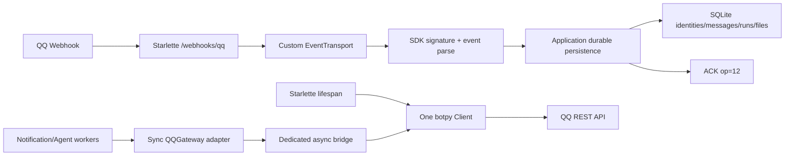

# QQ Bot 适配器设计

## 1. 结论摘要

本项目可以在单进程 Starlette 应用内采用 `qq-botpy-sdk==2.0.4`，但不能直接使用 SDK 默认的 `WebhookTransport.handle_request()` 作为持久化入口。

在决定接入前还必须验证 API 域名：SDK 2.0.4 默认使用 `api.sgroup.qq.com` 和 `bots.qq.com`，而当前 QQ 官方文档将 API 与获取访问凭证接口列在 `api.bot.qq.com`。当前仓库的 `qq_api_base_url` 仍保留显式配置的默认值 `api.bot.qq.com`，但 `qq_token_base_url` 不再设置任何默认值；启用 QQ 凭据时必须显式提供 Token 域名。`bots.qq.com` 只作为用户明确选择的、未经验证的 SDK 旧域名兼容 fallback，不能作为生产默认值。是否所有接口和当前账号都接受显式覆盖，必须通过用户参与的在线冒烟验证；在验证前不能把 2.0.4 视为可直接上线的生产依赖。

本文同时记录当前实现状态和后续在线验收边界。Todo 3-7 已完成 SDK
transport、durable webhook、provider target、URL 附件下载、异步桥、C2C
出站适配器、媒体/文件契约和生产工厂的确定性本地实现；这些能力尚未
通过真实 QQ 账号、当前 API/Token 域名或真实接收者验证，因此不能宣称
实时平台兼容或普通文件生产可用。无凭据时仍使用 FakeQQGateway。

SDK 默认 Webhook 流程在收到 `op=0` 事件后调用 `asyncio.create_task(self._dispatch(payload))`，随后立即返回 `{"op": 12, "d": 0}`。SDK 自带测试 `test_ack_does_not_wait_for_event_handler` 也明确验证了这一行为。因此，直接复用默认 handler 会在 SQLite 持久化完成前向 QQ ACK，无法满足本项目现有的 durable ingestion 语义。

当前实现已按以下方案落地，并由本地契约测试证明；真实平台行为仍需
后文的人工作业门控：

1. Starlette 继续唯一拥有 `/webhooks/qq` HTTP 路由和监听器。
2. SDK 只负责 QQ REST API、Token、Webhook 验签/验证响应所需的协议组件、事件模型和消息发送。
3. 通过 SDK 的最小 `EventTransport` 协议注入自定义 transport；验签和解析的复用方式必须以固定 commit 源码为准并通过契约测试证明，不能仅因协议可注入就视为 SDK 已提供该组合。应用 handler 在 SQLite 事务提交成功后才返回普通事件 ACK。
4. 事件重复投递仍按 at-least-once 处理；不宣称 exactly-once。
5. C2C 普通文件发送按“官方已文档化、SDK 已有代码路径、真实账号仍需在线冒烟验证”作为候选能力交付，不把 SDK 方法名当作平台能力证明。

## 2. 范围与非目标

### 确定性必须支持

- C2C 文本入站。
- C2C 被动文本回复，保留 `user_openid`、`message_id`、`event_id` 和 `msg_seq` 所需信息。
- C2C 主动文本推送。
- C2C 入站附件 URL 的受限下载、校验和本地持久化。
- Starlette lifespan 内单个 SDK Client 的启动与关闭。
- SQLite 事件/消息幂等、AgentRun 恢复和现有 FakeQQGateway 测试模式。

### 凭据门控候选能力

- C2C 普通文件的 SDK 发送路径；账号权限和平台实际能力必须通过用户参与的在线冒烟验证。图片、视频和语音不在本轮已验证能力承诺内，若实现扩展必须分别增加契约测试和在线冒烟验证。

### 明确不做

- 不启动 SDK 内置 Webhook HTTP Server。
- 不切换 WebSocket/Gateway 模式。
- 不引入 Node sidecar、子进程或第二个应用服务器。
- 不把 SDK 内存 ReplyLimiter、UploadCache 或 Session Store 当作业务事实。
- 不把 SDK 的非幂等主动 POST 自动重试作为业务可靠性保证。
- 不扩展群聊、频道、菜单、管理和流式消息功能。

## 3. 证据与版本边界

### SDK 版本

- 包：`qq-botpy-sdk==2.0.4`
- 源码仓库与核验 commit：<https://github.com/Teahouse-Studios/qq-botpy-sdk/tree/85936de5e7c834cd4a7a7a5c15877eeae116b47c>
- 核验 commit：`85936de5e7c834cd4a7a7a5c15877eeae116b47c`
- Python 声明：`>=3.10,<4.0`。
- 项目实际验证：Python 3.12 和 3.13 均可导入并构造 Webhook Client。
- 包身份：README 明确说明这是 Teahouse Studios 维护的社区项目，不是腾讯官方 SDK；PyPI 元数据分类为 Beta。
- 发布成熟度：2.0.4 是近期发布的社区 Beta 版本，公开生产采用证据有限；依赖应锁定版本和 wheel/sdist hash，并保留回滚路径。
- 运行时边界：项目只支持 Python 3.12 和 3.13；固定版本源码含有 Python 3.12 的 PEP 701 f-string，不得把 Python 3.11 作为支持版本，除非另行完成兼容性修复和验证。

### 关键源码证据

- `botpy/protocol/transport/webhook.py:38-50`：`WebhookServerAdapter` 只有 `listen()` 和 `close()`，可用于让外部服务器接管监听。
- `botpy/protocol/transport/webhook.py:181-206`：`WebhookTransport.start()` 注册服务器、等待 stop event，并在关闭时清理任务和服务器。
- `botpy/protocol/transport/webhook.py:233-261`：解析 JSON、处理 `op=13`、验签、创建 dispatch task，并立即返回 `op=12`。
- `botpy/protocol/transport/webhook.py:278-288`：真正的事件 handler 在后台 task 中执行，异常只进入 SDK error hook。
- `botpy/protocol/transport/base.py:9-17`：`EventTransport` 只要求异步 `start(handler)` 和 `close()`。
- `botpy/client.py:889-945,1001-1008`：`Client.start()` 在默认 webhook 模式下内部创建 `WebhookTransport`；传入自定义 transport 时可直接使用既有 transport，`ret_coro=True` 可返回 transport coroutine。
- `botpy/client.py:313-401`：`Client.send()` 使用 `ReplyTarget`，C2C 被动回复携带 `msg_id`、`event_id`、`msg_seq`。
- `botpy/client.py:591-648`：`send_file()` 经过 `upload_media()`，支持 URL、Base64、bytes、本地文件和分片上传。
- `botpy/api.py:2177-2240`：C2C 消息接口为 `/v2/users/{openid}/messages`，被动请求允许 `msg_id`、`msg_seq`、`event_id`。
- `botpy/api.py:2415-2446`：C2C 文件接口为 `/v2/users/{openid}/files`，支持 `file_type`、URL、Base64 和文件名。
- `botpy/protocol/reply.py:25-74`：默认被动回复限制为 4 次、3600 秒。

### 官方 QQ 文档证据

- [发送单聊消息](https://bot.q.qq.com/wiki/develop/api-v2/autogen/api/v2_users_user_openid_messages.post.html)：当前官方规则写明被动消息有效 60 分钟、每条最多回复 4 次；`msg_id`、`event_id`、`msg_seq` 的语义和响应消息 ID 也在此说明。页面显示更新于 2026-09-03。SDK 的部分迁移文档和注释仍写 5 分钟，属于过时说明，不能覆盖当前官方规则，也不能由 SDK 本地计时器替平台做保证。
- [富媒体消息概述](https://bot.q.qq.com/wiki/develop/api-v2/server-inter/message/rich-media.html)：官方列出 `file_type=4` 普通文件，单聊文件上传接口为 `/v2/users/{user_openid}/files`，并说明整文件 URL 上传与分片上传。
- [消息类型总览](https://bot.q.qq.com/wiki/develop/api-v2/server-inter/message/type/overview.html)：单聊文件为收发均支持的富媒体类型。
- [单聊消息事件](https://bot.q.qq.com/wiki/develop/api-v2/autogen/event/c2c_message_create.html)：入站附件提供 URL、文件名、大小和 MIME 类型等元数据。
- [API 调用指南](https://bot.q.qq.com/wiki/develop/api-v2/dev-prepare/api-call-guide.html) 与 [获取访问凭证](https://bot.q.qq.com/wiki/develop/api-v2/dev-prepare/access-token.html)：当前官方文档将 API 与获取访问凭证接口列在 `api.bot.qq.com`；该域名与 SDK 2.0.4 的默认 `api.sgroup.qq.com`/`bots.qq.com` 不一致。适配器必须把应用配置中的 API 和 Token 域名显式传入 SDK；`qq_token_base_url` 在启用凭据时没有默认值，覆盖后的路由兼容性仍未验证。

SDK 的部分 API 注释和迁移文档仍写“被动回复 5 分钟”或“文件暂不开放”。其中五分钟是过时 SDK 说明，不是当前官方被动回复规则；`ReplyLimiter` 的 3600 秒与官方 60 分钟规则一致，但仍只是本地 fallback 策略，不是平台有效期证明。设计与测试必须保留在线冒烟验证作为最终能力验证，并允许配置更保守的被动回复窗口。

## 4. 当前应用差距

### Todo 4 状态（2026-09-12）

本节中关于 `RunContext` 没有 provider identity 和可重建 `ReplyTarget` 的描述，属于 Todo 4 实施前的历史差距，不能再作为当前状态引用。Todo 4 已通过 migration `0008_qq_reply_targets` 将可空的 provider 元数据写入 `conversation_messages`，并让 `RunContext` 在进程重启后重建被动 `ReplyTarget`，同时在上下文更新时保留该 target。Todo 3、5、6、7 已完成确定性本地 SDK 接线、被动/主动发送选择、同步到异步 bridge、附件 URL 下载和出站媒体/文件契约；真实账号验证仍未实现。

当前代码已经具备可持久化入站基础：

- `src/jobs_status_manager/agent/webhook.py:83-219` 在事务中创建 `ConversationMessage`、`QQInboundIdentity`、`AgentRun`，重复事件返回 duplicate。
- `src/jobs_status_manager/agent/webhook.py:222-240` 由 Starlette 路由读取原始 body，完成校验、解析和持久化。
- `src/jobs_status_manager/agent/uploads.py` 已支持 SDK 附件 URL/metadata 的受限同步下载，同时保留 fake 使用的 Base64 兼容路径；下载和持久化失败均有清理测试。URL 下载发生在 Webhook 持久化事务之前，因此慢或失败的远程 URL 会使事件返回非成功并允许 QQ 重投。
- `src/jobs_status_manager/application/lifecycle.py:125-177,180-190` 通过同步 worker cycle 驱动 Agent 和恢复任务。
- （历史、Todo 4 之前）`src/jobs_status_manager/agent/runtime_support.py:41-145` 的 `RunContext` 只有内部 `user_id`，没有 provider openid、入站 message/event ID 或可重建的 ReplyTarget；当前实现已由 `0008_qq_reply_targets` 和 restart-safe reconstruction 补齐这一持久化上下文边界。
- `src/jobs_status_manager/infrastructure/adapters/protocols.py` 的 `QQGateway` 是同步接口，而 SDK Client/消息 API 是异步接口。
- `src/jobs_status_manager/infrastructure/adapters/factory.py` 在完整凭据和显式 Token endpoint 条件满足时创建 lifespan-owned QQ runtime；缺少凭据时仍只创建本地/fake 路径。
- 当前 webhook 由 Starlette 路由交给自定义 transport，已覆盖 SDK 签名头、`op=13`、durable `op=12`、关闭和 readiness 契约；应用兼容的 token/fake 测试路径仍保留。真实 QQ 签名和 URL challenge 仍未在线验证。
- 当前 Agent/Notification 回复已通过同步到异步 bridge 选择 durable passive target 或显式 proactive target，并记录 provider outcome；真实 QQ 回复和 provider message ID 仍未在线验证。

本轮实现已通过确定性测试解决四个边界；Todo 8 只剩真实平台边界待人工验收：

1. SDK Webhook 协议 ACK 与应用持久化的顺序。
2. SDK asyncio Client 与同步 QQGateway/worker 的桥接。
3. provider identity 和 ReplyTarget 的持久化重建。
4. QQ 附件 URL 模型与当前 Base64-only 上传模型的转换。

## 5. 目标架构



Mermaid 图只说明组件关系；HTTP 输入输出、事务边界、错误码、任务取消和资源所有权以正文契约和测试验收项为准。

### 组件职责

| 组件 | 所有权 | 职责 |
| --- | --- | --- |
| Starlette | 应用 | HTTP 路由、原始 body、签名 header、监听器、lifespan |
| Custom EventTransport | 基础设施 | SDK 验签/解析组合、调用应用事件 handler、等待持久化 receipt、生成 ACK |
| `botpy.Client` | lifespan | Token、标准 `httpx` HTTP client、SDK API、关闭资源 |
| QQ adapter | 基础设施 | 把同步 `QQGateway` 映射到异步 SDK，并隐藏 SDK 类型 |
| Agent/webhook application service | 应用 | 用户绑定、事件幂等、消息/附件/AgentRun 持久化 |
| SQLite | 业务事实 | 事件身份、对话、运行状态、投递状态、文件元数据 |

### 自定义传输的最小契约

- HTTP 入口接收一次原始 `body`、签名 headers 和请求上下文，不重复读取请求流。
- 传输层输出明确的 HTTP status、headers 和 JSON body；`op=13`、普通 `op=0`、验签失败、解析失败、未支持事件、持久化失败和关闭中断分别定义响应与重投语义。
- 每个受控 dispatch task 必须登记、设置并发上限，并在 lifespan 关闭时等待或取消；handler 异常不得被静默地当作已持久化成功。
- 只有普通事件的持久化 receipt 成功后，传输层才可生成 accepted `op=12`；该组合行为必须由固定 SDK commit 的契约测试证明。

## 6. Webhook 数据流与 ACK

### URL 验证 `op=13`

`op=13` 不属于普通业务事件，不进入 AgentRun，也不等待数据库事务。Adapter 应复用 SDK 的 validation response 规则，原样返回 `plain_token` 和签名字段。

当前应用保留 `x-qq-webhook-token` fake/兼容校验，并已实现 SDK/QQ 签名校验、`op=13` 验证响应、普通事件 durable ACK 和 `/webhooks/qq` 路由契约；每种模式均由本地测试覆盖。真实 QQ 签名、challenge 和可配置路径的在线行为仍需人工验证。

### 普通事件 `op=0`

目标流程：

1. Starlette 读取一次原始 body，并保留 `X-Signature-Timestamp` 与 `X-Signature-Ed25519`。
2. Custom EventTransport 验证 JSON、签名和事件类型。
3. SDK parser 产出 raw/normalized event；应用转换为 `QQInboundEvent`。
4. 应用执行 sender binding、event/message identity claim、消息、已下载附件和 AgentRun 持久化。
5. 事务提交成功后返回 persistence receipt。
6. Custom EventTransport 返回 `200 {"op": 12, "d": 0}`。
7. Agent 执行不属于 ACK 前置条件；持久化后即可由现有 worker 异步处理。

### 失败语义

- 验签失败：401，不 ACK。
- JSON/事件格式错误：400，不 ACK。
- 不支持事件：按现有协议返回 ignored/非业务成功，不创建 AgentRun。
- sender 不匹配：403，不创建业务记录。
- SQLite/文件元数据持久化失败：非成功响应，不返回 accepted ACK；QQ 可重投。当前远程附件下载在持久化前同步完成，下载失败同样返回非成功且不提交事件。
- 已存在 event/message identity：返回现有 duplicate 语义，避免重复 Run/File。
- 进程在事务提交前退出：不应产生 accepted ACK，重投由幂等逻辑吸收。
- 进程在事务提交后、ACK 返回前退出：允许 QQ 重投，由 identity 唯一约束吸收。

## 7. 生命周期与异步桥接

### 生命周期

- Starlette lifespan 创建一个 `botpy.Client` 和一个 custom `EventTransport`。
- 不使用 `transport="webhook"` 的内部默认创建路径，因为该路径固定使用立即 ACK 的 `WebhookTransport`。
- 使用 `transport=<custom_event_transport>` 注入 transport；Client 的 `start()` 以 `ret_coro=True` 获取 transport coroutine，再由 lifespan task 管理。
- lifespan shutdown 顺序：停止接收新业务事件、等待或取消受控 dispatch task、关闭 Client、关闭 async bridge、释放数据库外资源。
- 不在每个请求调用 `asyncio.run()`；不在已有 event loop 中创建嵌套 loop。

### 同步 `QQGateway` 到异步 SDK

推荐一个由 lifespan 创建的专用 asyncio loop/bridge，或使用应用现有 AnyIO 线程到主 loop 的线程安全门户。具体实现必须满足：

- 所有 SDK Client 方法都在拥有 Client 的 loop 上执行。
- 同步 `push/reply` 只等待一个明确超时的 future。
- shutdown 时拒绝新调用并让已提交调用得到确定结果。
- 不把 SDK Client、`ReplyTarget` 或 `InboundMessage` 泄露到应用层。
- 未启动、关闭中、超时、明确拒绝、网络结果不确定和成功必须分别映射为 `QQDeliveryResult` 的可持久化状态；成功时保存脱敏后的 provider message ID，超时或网络未知不得伪装成明确失败。
- 主动 POST 的网络不确定失败不自动重试；确定性失败是否进入持久化恢复由投递状态决定。被动回复可在保留 `msg_id + event_id + msg_seq` 时使用受控语义。

## 8. C2C 身份、消息与投递

### 入站保存

每条支持的 C2C 事件至少保存：

- `provider="qq"`
- `user_openid`
- provider event ID
- provider message ID
- event type
- 原始/规范化内容
- 可选 `ReplyTarget(scope="c2c", target_id=user_openid, message_id=..., event_id=..., msg_seq=...)`

内部 `User.id` 仍由现有 bootstrap identity 决定；`user_openid` 是 provider identity，不应直接替代内部用户主键。单用户部署可以用配置的 `APP_QQ_USER_OPENID` 做 sender binding，但发送目标仍应从持久化入站上下文重建。

### 被动回复

- 当前 Agent 回复路径优先使用 durable `ReplyTarget` 的被动回复，并在无被动上下文时使用显式 proactive target；真实 SDK 发送结果仍属于凭据门控验证。
- 有可靠入站 `message_id`/`event_id` 时，优先发送被动回复。
- SDK `ReplyLimiter` 默认 4 次/3600 秒，与当前官方 60 分钟、最多 4 次规则一致；SDK 其他五分钟文字已过时，因此该值只能视为本地 fallback，不是平台有效期保证。
- 超过被动限制后，SDK 会去掉 `msg_id`、`event_id`、`msg_seq`，转主动消息；应用投递记录必须能区分两种模式。
- 消息响应中的 provider message ID 应写入现有 delivery/outbox 结果。

### 主动推送

- 只使用 `target_id=user_openid`，不带过期的被动字段。
- 主动发送成功后保存 QQ message ID。
- 对结果不确定的非幂等 POST 不做盲目自动重试，避免重复消息；确定性失败才可按现有持久化投递状态进入下一轮恢复，结果不确定时转人工处理或明确阻断。
- 该限制不禁止现有 Notification Dispatcher 对已持久化通知执行有上限的恢复重试；实现必须区分 NotificationAttempt 与 Agent 当前回复，分别记录状态、错误类别、尝试次数、退避和 stale 状态恢复。

## 9. 文件与媒体

### 入站附件

官方 C2C 事件附件是 URL + metadata；当前实现将单个附件转换为内部事件并在持久化前同步下载：

- `provider_file_id`、attachment URL、filename/content_type/size_bytes 均在边界解析。
- 多于一个附件的事件被拒绝，不会静默丢弃其余附件。
- 不把 URL 本身当作可信文件内容。

当前同步下载占用 Webhook ACK 窗口，并由总截止时间、大小/MIME/HTTPS/SSRF 校验和 `.part` 清理限制风险。ACK 后 `PENDING`/可恢复下载 worker 尚未实现，需要新增文件状态、任务和迁移；它属于后续工作，本轮不宣称已实现。

下载器必须：

- 只允许 HTTPS。
- 限制响应大小、连接/读取超时和总耗时。
- 校验最终响应 Content-Length/实际字节数与上限。
- 禁止重定向到 loopback、RFC1918、link-local、metadata service 等私网地址。
- 校验 MIME、扩展名和文件头，防止伪造类型。
- 先写临时文件，数据库事务失败时删除临时文件。
- 不在日志中输出 URL query、token 或文件内容。

### 出站文件

官方文档当前列出单聊文件收发支持，SDK 提供 `send_file()`、`upload_media()` 和 `/v2/users/{openid}/files` 路径。SDK 某些 docstring 仍写“文件暂不开放”，但官方文档已列出该能力，所以验收分为：

1. 无凭据契约测试：验证 `file_type=4`、URL/bytes/local path 映射和 response parsing。
2. 凭据门控的在线冒烟验证：验证真实账号是否能上传、得到 `file_info`、发送 `msg_type=7`，并记录 HTTP 状态与脱敏 provider message ID。

未完成第二步前，产品状态只能标记为 `capability_pending`，不能标记为稳定可用。

## 10. 配置与部署

建议使用现有 `APP_` 前缀。AppSecret、访问 token 和 Webhook token 使用 `SecretStr`；AppID、openid、URL、路径、超时和字节数限制使用相应的非 `SecretStr` 类型，但真实 `user_openid` 仍按敏感数据保护，不应把所有配置都声明为 `SecretStr`：

- AppID/AppSecret。
- Webhook path；实际监听 host/port 仍由 `APP_HOST`/`APP_PORT` 控制。
- QQ user openid binding。
- SDK API/token timeout。
- SDK API base URL/token base URL；当前应用设置的 API 默认值为 `api.bot.qq.com`，Token URL 没有默认值，启用 QQ 凭据时必须显式配置并传入 SDK。`bots.qq.com` 只能由操作者明确选择为未经验证的旧 SDK 兼容 fallback，不能隐式依赖或写成生产默认值。实时验证前，Token 域名兼容性仍是未决风险。
- 入站附件最大字节数、连接超时、读取超时。
- 文件下载使用实现内的允许 MIME/扩展名策略，并由 URL、大小、类型和清理测试覆盖；如未来开放新的类型，应追加契约与在线验证。
- 真实 QQ adapter 只有在 `APP_QQ_ENABLED=true` 且凭据和 HTTPS endpoint 完整时才由生命周期自动构造；关闭门控或缺少配置时保持 FakeQQGateway/no-QQ。真实平台兼容仍需人工批准和实时验证。

缺少完整 QQ 凭据或关闭显式门控时继续保留 FakeQQGateway 和本地无凭据 demo。仅存在部分凭据时启动应安全失败，不输出 SecretStr 内容。QQ API/Token URL、Webhook path 和超时字段已进入 runtime 配置，但真实 endpoint 兼容性仍必须在线确认，不能把“已配置”理解为“已验证”。

部署约束：

- 单进程、单 SQLite 数据库、单 SDK Client。
- 反向代理终止公网 HTTPS，再转发到 Starlette。
- 只开放 `/webhooks/qq` 所需路径。
- secret 通过环境变量或受保护 secret store 注入。
- 文档、测试和日志可以出现配置字段名及合成占位符，但不得出现真实 AppSecret、Webhook token、访问 token 或 `user_openid`；如需关联记录，只使用不可逆脱敏别名或哈希。禁止写入真实业务 URL、附件下载 URL、presigned URL、URL query、签名 header 和完整 provider payload；公共官方文档 URL 可以保留。

## 11. 测试与验收

### 确定性测试

- SDK signature/validation 契约测试。
- 自定义 EventTransport 的 ACK barrier test：handler 未完成持久化时，调用不得返回普通 ACK。
- persistence success/failure/duplicate test。
- lifespan startup/close/cancellation/duplicate-start test。
- C2C ReplyTarget 映射和被动/主动字段 test。
- sync-to-async bridge timeout/close test。
- attachment HTTPS/size/MIME/SSRF/redirect test。
- fake media/file request mapping test。

### 在线冒烟验证（凭据门控与人工协作）

以下验证必须由用户明确授权并参与。批准至少要确认测试账号和接收者、测试消息/文件、预计副作用、时间窗口、凭据注入方式、停止条件和清理方案；批准记录只保存协作者标识和时间，不保存凭据。用户负责观察或确认真实 QQ 行为；执行者不得自行猜测、生成或保存凭据，也不得在没有用户参与的情况下把验证结果写成通过。出现未知权限、错误码、重复消息、非预期接收者、敏感响应或不可逆副作用时立即停止并切回 FakeQQGateway。本任务不执行任何真实 QQ Endpoint 调用，不能以本地测试、SDK 源码或导入 smoke 替代人工协作验证。

后续仅通过环境变量执行，不把凭据或原始 provider payload 写入证据。每次验证只记录测试时间、代码/SDK 版本、配置域名、测试项、HTTP 状态、QQ `err_code`、脱敏 trace/provider ID、`PASS/FAIL/BLOCKED/NOT_RUN` 结果、外部副作用、清理结果和批准人标识：

1. QQ URL validation。
2. C2C text receive and durable ACK。
3. Passive text reply with provider message ID。
4. Proactive text push。
5. C2C attachment receive/download/store。
6. Ordinary file upload/send, or explicit blocked result with HTTP status/error code。
7. Process shutdown and restart recovery。
8. 使用操作者提供并确认的 Token 域名，以及当前官方文档所列的 `api.bot.qq.com` API 域名进行 Token 获取、C2C 文本发送和文件上传；同时记录显式覆盖域名的结果，确认生产路径不依赖未经验证的旧域名兼容行为。未获得确认时标记 `BLOCKED`，不得把 `bots.qq.com` 当作生产默认值。

### 质量门

```text
uv lock --check
uv run pytest -q
uv run ruff check .
uv run ruff format --check .
uv run basedpyright
uv run alembic check
```

SDK 2.0.4 checkout 的上游 `tests/test_webhook.py` 依赖 `tests/.test.yaml`，当前源码快照缺少该文件，导致直接收集上游测试失败。项目验收不能把该上游测试命令作为唯一门槛，应使用本项目独立 contract tests，同时记录该上游测试缺口。

## 12. 可观察性

- 结构化日志至少关联 `provider`、内部 `event_id`、内部 `run_id`、投递模式和结果类别；provider ID 仅在脱敏后记录。
- 记录 ACK 阶段、持久化 receipt、SDK 请求结果、重试判定和关闭阶段，区分确定性失败与结果不确定。
- 禁止记录 AppSecret、Webhook token、访问 token、openid、签名 header、URL query、附件内容和完整 provider payload。
- 指标和日志只能用于运行观测，不能替代 SQLite 中的事件、消息、运行和投递事实。

## 13. 分阶段任务

Todo 4 已完成本设计所需的 provider-neutral contract、入站 provider 元数据持久化、`0008_qq_reply_targets` schema migration、restart-safe `RunContext` reconstruction，以及无网络 fake seams。Todo 3、5、6、7 已完成真实 SDK 接线的确定性本地部分、同步/异步 bridge、发送、下载和部署工厂；部署后的真实 endpoint、账号能力、普通文件和重启在线行为仍等待 Todo 8 人工验收，本状态不扩大交付范围。

### 阶段 1：依赖与配置

- 锁定 `qq-botpy-sdk==2.0.4`。
- 增加 AppID/AppSecret、Webhook 和附件限制配置。
- 保持缺少凭据时的 FakeQQGateway。
- 增加配置完整性和安全错误测试。

### 阶段 2：自定义 EventTransport 与 durable Webhook

- 新增 custom `EventTransport`/受控 Webhook transport。
- 复用 SDK 验签、`op=13` 和事件解析能力，或以固定 commit 的最小源码组合方式实现等价协议行为。
- Starlette 路由将原始 body/header 交给 adapter。
- 普通事件在事务提交后才返回 `op=12`。
- 增加 malformed/signature/persistence failure/duplicate/shutdown 测试。

### 阶段 3：provider identity 与 C2C 出站

- 扩展入站事件和 durable run/delivery context。
- 保留 `user_openid`、event/message ID 和 ReplyTarget 数据。
- 通过版本化 schema migration 增加所需字段或表，升级和回滚都必须保留既有 SQLite durable 数据。
- 建立同步 QQGateway 到 SDK async Client 的单 loop bridge。
- 实现文本被动回复、主动推送和 provider message ID 记录。
- 明确 ambiguous POST 不自动重试。

### 阶段 4：附件与文件

- 将附件接收从 Base64-only 改为 URL/metadata 下载模型。
- 增加 SSRF、大小、类型、重定向和临时文件清理保护。
- 接入 SDK media/file send path。
- 运行 credential-free contract test 和 credential-gated live file smoke。

### 阶段 5：生产接线与部署验收

- 在 factory/lifespan 注册完整 QQ adapter。
- 补充反向代理 HTTPS、secret 权限、单进程/SQLite 和日志相关文档。
- 执行完整本地质量门（已完成，详见 Todo 8 evidence）。
- 记录 live smoke 的 HTTP 状态、脱敏 provider IDs、capability pass/fail/blocked 和恢复结果（待人工批准和真实账号）。

## 14. 回滚与风险

- QQ 凭据不完整、SDK 启动失败或 live smoke 未通过时，保持 FakeQQGateway/local mode，不半启用真实 adapter。
- 未取得人工批准、批准已过期、测试账号/接收者不匹配或未完成清理确认时，禁止启用真实 QQ adapter，保持 FakeQQGateway/local mode。
- 自定义 transport 出现协议不兼容时，可临时关闭真实 QQ adapter，保留已持久化数据库和 fake demo；不能退回“立即 ACK 但宣称 durable”的错误语义。
- SDK 是社区 Beta 项目，升级必须重新核验 Webhook ACK、`EventTransport`、C2C media/file API、依赖、默认 API 域名和上游测试状态。
- SDK 默认 API/Token 域名落后于当前官方文档；如果显式覆盖到 `api.bot.qq.com` 后仍有任一路由不兼容，则停止生产接线，改用原始 QQ API adapter 或等待 SDK 修复。
- 标准 `httpx` 与项目 `httpx2` 并存；两套 client、mock、timeout 和日志配置必须分开处理，不能假设可互换。
